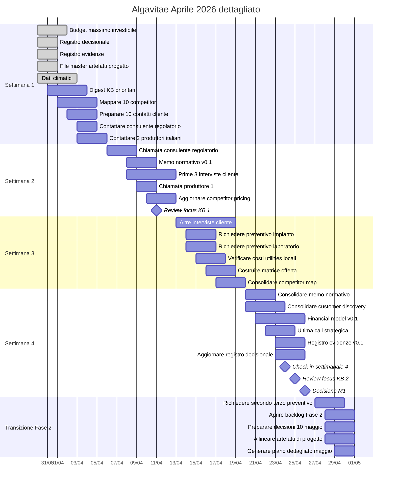

# Gantt dettagliato aprile 2026 — Algavitae

## Checklist operativa aprile

### Settimana 1
- [x] Definire il budget massimo investibile
- [x] Creare Registro Decisionale
- [x] Creare Registro Evidenze
- [x] Creare o aggiornare file master degli artefatti di progetto
- [x] Raccogliere dati climatici Marche/Fermo
- [ ] Estrarre digest KB dai focus prioritari
- [ ] Mappare almeno 10 competitor / operatori
- [ ] Preparare lista di almeno 10 contatti cliente
- [ ] Contattare un consulente regolatorio
- [ ] Contattare almeno 2 produttori italiani

### Settimana 2
- [ ] Fare la call con il consulente regolatorio
- [ ] Scrivere memo normativo v0.1
- [ ] Fare almeno 3 interviste cliente
- [ ] Fare almeno 1 call con produttore italiano
- [ ] Aggiornare competitor pricing
- [ ] Fare la review focus KB #1

### Settimana 3
- [ ] Fare altre 2–3 interviste cliente
- [ ] Richiedere almeno 1 preventivo impianto
- [ ] Richiedere almeno 1 preventivo laboratorio
- [ ] Verificare costi utilities locali
- [ ] Costruire matrice offerta iniziale
- [ ] Consolidare competitor map v0.1

### Settimana 4
- [ ] Consolidare memo normativo
- [ ] Consolidare report customer discovery
- [ ] Costruire financial model v0.1
- [ ] Fare ultima call / intervista strategica
- [ ] Consolidare Registro Evidenze v0.1
- [ ] Aggiornare Registro Decisionale con decisioni, ipotesi confermate e open point
- [ ] Fare check-in settimanale #4
- [ ] Fare review focus KB #2
- [ ] Prendere Decisione M1 il 26 aprile

### Transizione a Fase 2
- [ ] Richiedere secondo e terzo preventivo
- [ ] Aprire backlog Fase 2
- [ ] Allineare e aggiornare gli artefatti necessari:
  - [ ] Registro Decisionale
  - [ ] Registro Evidenze
  - [ ] memo normativo v0.1
  - [ ] customer discovery v0.1
  - [ ] financial model v0.1
  - [ ] stato Decisione M1
- [ ] Generare il piano dettagliato di maggio a partire dal master plan e dallo stato reale di fine aprile
- [ ] Preparare le decisioni obbligatorie del 10 maggio:
  - [ ] food vs cosmetic
  - [ ] fresco vs secco
