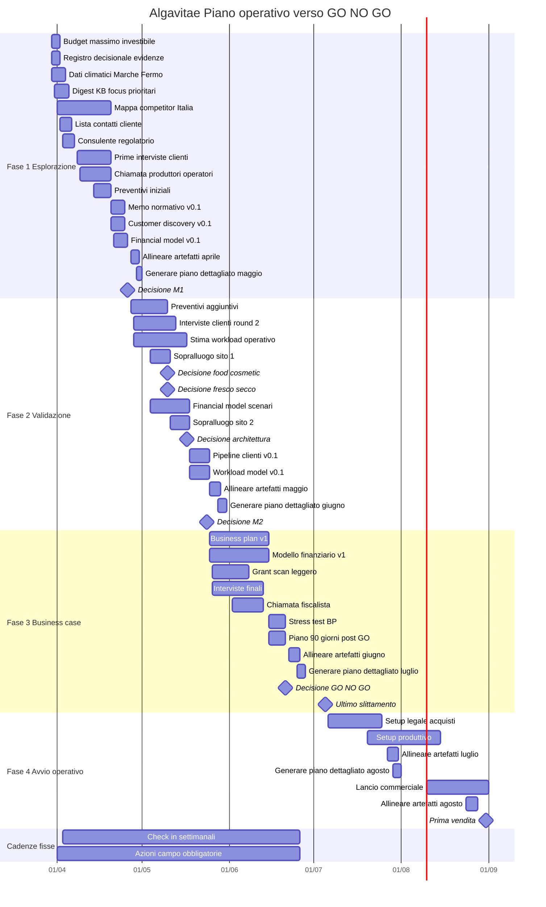

# Gantt — Piano Operativo Algavitae

Questo file è pensato per Obsidian con supporto Mermaid.

## Nota d'uso
- Apri questo file in Obsidian in modalità preview per vedere il diagramma.
- Le decisioni M1, M2 e GO/NO-GO sono i veri gate del piano.
- A fine di ogni mese operativo, aggiorna gli artefatti di progetto e genera il piano dettagliato del mese successivo.
